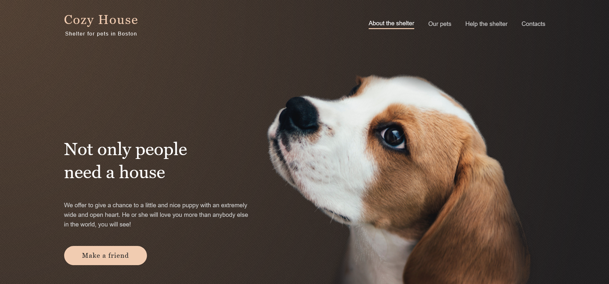
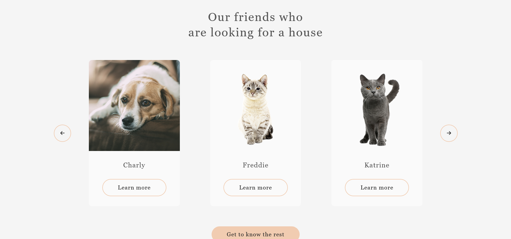
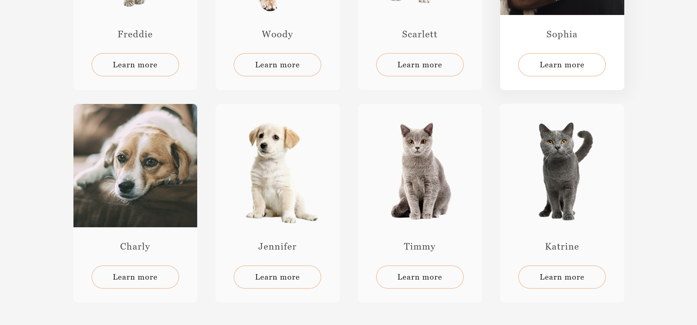

# [Plants Landing page](https://eugenezanevskij.github.io/shelter/)

Shelter - is a project in which you have to build a site consisting of two pages, make it adaptive and interactive.

## Key skills:
- valid semantic adaptive layout
- easily maintainable readable code
- exporting styles and graphics from Figma
- using JavaScript to implement the functionality specified in the task

## Table of contents

- [Overview](#overview)
  - [The challenge](#the-challenge)
  - [Screenshot](#screenshot)
  - [Links](#links)
- [My process](#my-process)
  - [Built with](#built-with)
  - [What I learned](#what-i-learned)
  - [Useful resources](#useful-resources)
- [Author](#author)

## Overview

### The challenge

- View the optimal layout depending on their device's screen size
- See hover and focus states for interactive elements
- Implement responsive navbar
- Popup for pets' cards on both pages
- Infinite carousel of pets on main page
  - When switching to the left or right, exactly as many cards are scrolled as shown at the current screen width
  - cards with pets are not repeated in the current block of the slide
  - in the next block there is no duplication of cards with the current block
  - only one previous state is being remembered
  - every time the page is reloaded, a new sequence of cards is generated
- Pagination of pets on pets page
  - when the page loads, an array of 48 pet objects is formed. Each of the 8 pets must appear exactly 6 times
  - every time the page is reloaded, a new array is formed with a random sequence
  - pet cards should not be repeated on the same page
  - when switching the page, the data changes
  - returning to the page under a certain number, the content on it will always be the same

### Screenshot

Desktop version

- Slider on main page

- Pagination of pets on pets page

### Links

- Solution URL: [Shelter GitHub](https://github.com/EugeneZanevskij/shelter)
- Live Site URL: [Shelter page Live version](https://eugenezanevskij.github.io/shelter/)

## My process

### Built with

- Semantic HTML5 markup
- Flexbox
- Desktop-first workflow
- BEM
- SCSS
- Figma
- JS
- webpack

### What I learned

This was one of the RS Schools' projects. 
One of the main tasks was 100% accuracy of layout. I used PerfectPixel to check that.
Requirements to slider and pagination were solved as a result of reading lots of literature in order to get any idea how to solve it.

This project was the first time I used webpack for transforming scss to css.

### Useful resources

- [Sass Guidelines](https://sass-guidelin.es/) - An opinionated styleguide for writing sane, maintainable and scalable Sass.
- [Sass Basics](https://sass-lang.com/guide) - Basics on how to transform SCSS into CSS using terminal.
- [BEM](https://css-tricks.com/bem-101/) - Basics of BEM methodology.

## Author

- LinkedIn - [Eugene Zanevskij](https://www.linkedin.com/in/eugene-zanevskij/)
- GitHub - [@EugeneZanevskij](https://github.com/EugeneZanevskij)